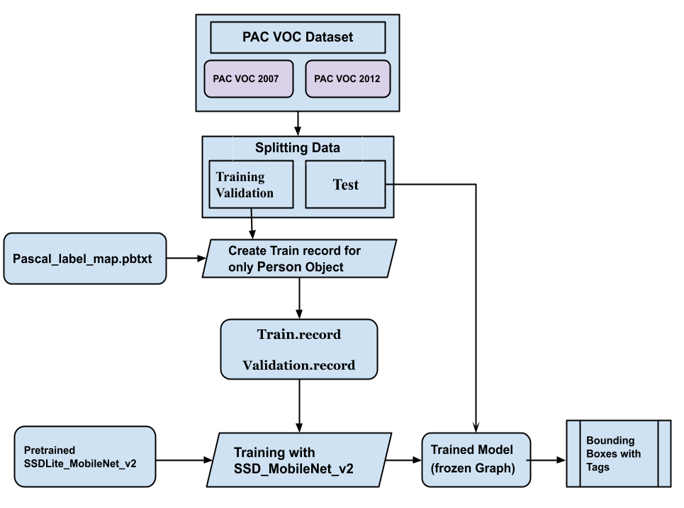
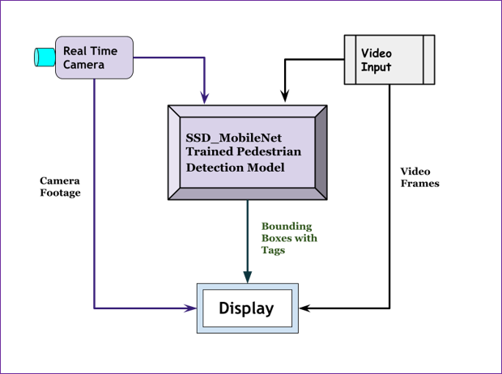

#### Real Time Pedestrian Detection Python Kivy GUI Application

 Research Project on Pedestrian Detection using Deep Learning (SSD-MobileNet_V2) and Simple Kivy based  Cross Platform Application (GUI) which runs on Windows, macOS, Android, iOS, Linux, and even on Raspberry-Pi.. Here users can input video from local machine using File Dialog or Real Time Detection from Web camera.

* <b>User Interface of Pedestrian Detection App</b>
---

* <b>Real Time Detection using GUI</b>

* <b>Inputting local Video File(.mp4) using GUI</b>

* <b>Architecture of the Pedestrian Detection System (Training Model):</b>
---

* <b>Real Time Pedestrian detection: </b>
---

* For more details refer PPT_About_Project

   
